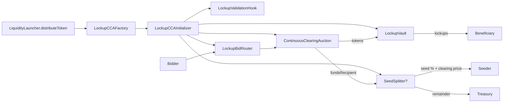

## Foundry

**Foundry is a blazing fast, portable and modular toolkit for Ethereum application development written in Rust.**

Foundry consists of:

- **Forge**: Ethereum testing framework (like Truffle, Hardhat and DappTools).
- **Cast**: Swiss army knife for interacting with EVM smart contracts, sending transactions and getting chain data.
- **Anvil**: Local Ethereum node, akin to Ganache, Hardhat Network.
- **Chisel**: Fast, utilitarian, and verbose solidity REPL.

## Documentation

https://book.getfoundry.sh/

## Lockup CCA Strategy

This app includes a minimal lockup strategy that deploys a Continuous Clearing Auction (CCA) and enforces tranche-based lockups without Uniswap LBP/migration logic. It is implemented under `src/strategies/lockups/` and is intended to be used as a LiquidityLauncher distribution strategy.

### Overview

- **LockupCCAFactory**: `IDistributionStrategy` implementation. Deploys a new initializer for each offering.
- **LockupCCAInitializer**: `IDistributionContract` implementation. Deploys:
  - `ContinuousClearingAuction` (CCA)
  - `LockupValidationHook` (enforces reserve price + tranche caps)
  - `LockupBidRouter` (forces bids through vault)
  - `LockupVault` (locks claimed tokens by tranche)
  - Optional `SeedSplitter` (splits raised funds for pool seeding)
- **LockupValidationHook**: Checks reserve price, tranche caps, and router/vault usage.
- **LockupBidRouter**: Submits bids with hook data and registers them in the vault.
- **LockupVault**: Exits bids, tracks refunds, and locks tokens until tranche unlock.
- **SeedSplitter (optional)**: If enabled, forwards a % of raised funds to a pool seeder and the remainder to a treasury recipient. The seeder receives the final clearing price for fair pricing.

### Config Encoding

`LockupCCAFactory.initializeDistribution` expects `configData` encoded as:

```solidity
abi.encode(
  AuctionParameters auctionParams,
  LockupParameters lockupParams
)
```

Where:

```solidity
struct LockupParameters {
  uint128[4] trancheCaps;      // caps per tranche, in currency amount
  uint32[4] lockupMonths;      // e.g. [3,6,9,12]
  SeedConfig seedConfig;       // optional pool seeding config
}

struct SeedConfig {
  uint24 poolSeedBps;          // 0..10_000
  address poolSeeder;          // contract that chooses v3/v4 + new/existing
  address treasuryRecipient;   // remainder recipient
  bytes seedData;              // opaque seed params
}
```

### Mermaid Diagram



### Notes

- Tranche caps are enforced on **currency amount**, not token amount.
- If you need exact token tranches, deploy separate CCAs per tranche.
- Pool seeding is optional and does **not** modify the CCA logic.

## Usage

### Build

```shell
$ forge build
```

### Test

```shell
$ forge test
```

### Format

```shell
$ forge fmt
```

### Gas Snapshots

```shell
$ forge snapshot
```

### Anvil

```shell
$ anvil
```

### Deploy

```shell
$ forge script script/Counter.s.sol:CounterScript --rpc-url <your_rpc_url> --private-key <your_private_key>
```

### Cast

```shell
$ cast <subcommand>
```

### Help

```shell
$ forge --help
$ anvil --help
$ cast --help
```
